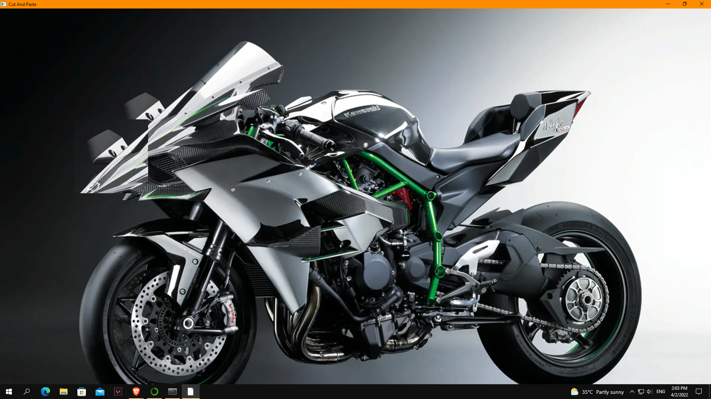

# READ AND WRITE AN IMAGE
## AIM
To write a python program using OpenCV to do the following image manipulations.
i) Read, display, and write an image.
ii) Access the rows and columns in an image.
iii) Cut and paste a small portion of the image.

## Software Required:
Anaconda - Python 3.7
## Algorithm:
### Step1:
Choose an image and save it as a filename.jpg
### Step2:
Use imread(filename, flags) to read the file.
### Step3:
Use imshow(window_name, image) to display the image.
### Step4:
Use imwrite(filename, image) to write the image.
### Step5:
End the program and close the output image windows.
## Program:
### Developed By: SRIJITH R
### Register Number: 212221240054
~~~
i) #To Read,display the image
import cv2
a = cv2.imread('ninja.jpg',1)
cv2.imshow("SUPER BIKE",a)
cv2.waitKey(0)
~~~
~~~
ii) #To write the image
import cv2
colorImage = cv2.imread('ninja.jpg',1)
cv2.imwrite('written.jpg',colorImage)
writtenImage = cv2.imread('written.jpg',1)
cv2.imshow('WrittenImage',writtenImage)
cv2.waitKey(0)
~~~
~~~
iii) #Find the shape of the Image
import cv2 
colorImage = cv2.imread('ninja.jpg',1)
print(colorImage.shape)
~~~
~~~
iv) #To access rows and columns
import cv2
import random
colorImage = cv2.imread('ninja.jpg',1)
for i in range(100):
    for j in range(colorImage.shape[1]):
        colorImage[i][j]=[random.randint(0,255),random.randint(0,255),random.randint(0,255)]
cv2.imshow('to access rows and columns',colorImage)
cv2.waitKey(0)
~~~
~~~
v) #To cut and paste portion of image
import cv2
color_img = cv2.imread('ninja.jpg',1)
tag = color_img[200:400,300:500]
color_img[300:500,200:400] = tag
cv2.imshow('Cut And Paste',color_img)
cv2.waitKey(0)
~~~

## Output:

### i) Read and display the image:

### ii)Write the image:

### iii)Shape of the Image:

### iv)Access rows and columns:

### v)Cut and paste portion of image:

## Result:
Thus the images are read, displayed, and written successfully using the python program.

